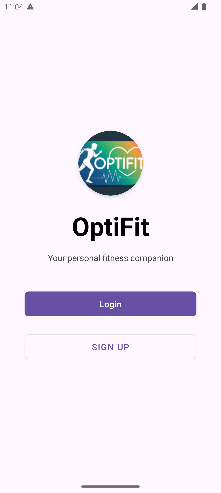
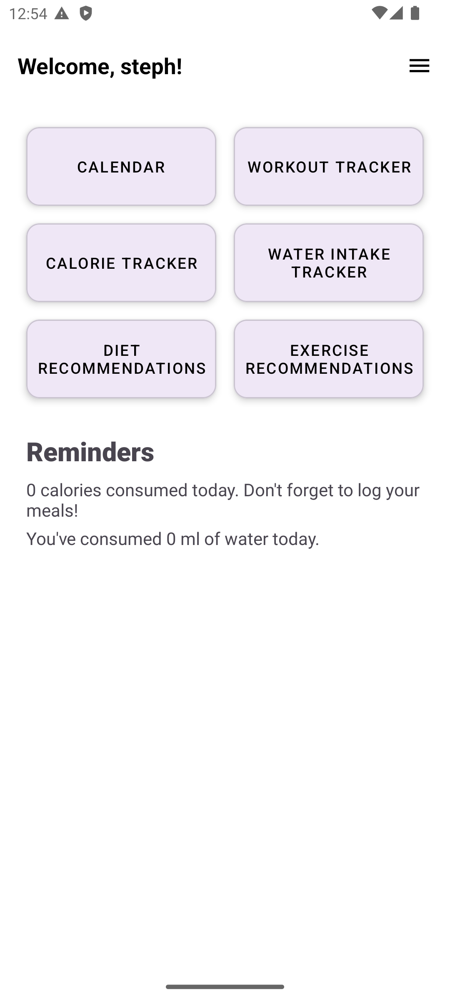

# Introduction

  

    

      

        <h1 class="hero-title">OptiFit</h1>
        
Your personalized fitness companion

        
Track meals, workouts, and hydration through our intuitive Android app designed for all fitness levels.

        

          
          
        

      

      

        
      

    

  

<section class="project-overview section">
  

    <h2 class="section-title"><i class="fas fa-project-diagram"></i> Project Overview</h2>
    

      

        
Optifit is a comprehensive mobile application designed to transform how users approach their fitness journey. By combining intuitive tracking tools with motivational features, we help users develop sustainable healthy habits and lifestyles.

        

          <h3><i class="fas fa-bullseye"></i> Core Value Proposition</h3>
          
 :

        

       

          

            <i class="fas fa-mobile-alt"></i>
            All-in-one health tracking platform
          

          

            <i class="fas fa-chart-pie"></i>
            Data visualization for progress tracking
          

          

            <i class="fas fa-bell"></i>
            Smart reminders and calender
          

          

            <i class="fas fa-user-cog"></i>
            Personalized recommendations
          

          

            <i class="fas fa-chart-line"></i>
            <strong>Tracking Modules:</strong> Diet, exercise, and hydration tracking with calendar
          

        

      

      

        
      

    

  

</section>

  

    

      <h2><i class="fas fa-star"></i> Our Vision</h2>
      
"To make health tracking so enjoyable that wellness becomes second nature, through an app that feels like a trusted friend cheering you on."

        <h3><i class="fas fa-trophy"></i> Success Metrics</h3>
        

          

            
5,000+

            
Downloads in first month

          

          

            
50%+

            
Preference over competitors

          

          

            
3x

            
Weekly active usage

          

        

      

    

  

<section class="features-section section">
  

    <h2 class="section-title">Designed for Every Fitness Journey</h2>
    
OptiFit serves users looking to monitor their fitness journey in a centralized, easy-to-use platform that adapts to different lifestyles and goals.

    

      

        

          <i class="fas fa-user-clock"></i>
        

        <h3>Time-Strapped Beginners</h3>
        
Uses quick-log features in Water Tracker and Diet Recommendation plans

        <ul class="profile-features">
          <li><i class="fas fa-check"></i> 2-minute signup</li>
          <li><i class="fas fa-check"></i> One-tap water logging</li>
          <li><i class="fas fa-check"></i> Pre-made meal plans</li>
        </ul>
      

      

        

          <i class="fas fa-user-chart"></i>
        

        <h3>Data-Driven Users</h3>
        
Leverages Calorie Charts and detailed Exercise Recommendation analytics

        <ul class="profile-features">
          <li><i class="fas fa-check"></i> Comprehensive Calorie Charts</li>
          <li><i class="fas fa-check"></i> Advanced exercise analytics</li>
          <li><i class="fas fa-check"></i> Custom workout plans</li>
        </ul>
      

      

        

          <i class="fas fa-users-cog"></i>
        

        <h3>Profile Managers</h3>
        
Frequently uses User Profile to adjust goals and preferences

        <ul class="profile-features">
          <li><i class="fas fa-check"></i> Easy profile updates</li>
          <li><i class="fas fa-check"></i> Goal overview</li>
          <li><i class="fas fa-check"></i> Progress recalibration</li>
        </ul>
      

    

  

</section>

<section class="features-section light-bg section">
  

    <h2 class="section-title">Core Activity Features</h2>
    

      

        

          <i class="fas fa-calendar-alt"></i>
        

        

          <h3>Unified Calendar</h3>
          

            
<i class="fas fa-check-circle"></i> View all activities in Simple Calendar

            
<i class="fas fa-check-circle"></i> Diet and exercise integration

            
<i class="fas fa-check-circle"></i> Progress timeline via charts

          

        

      

      

        

          <i class="fas fa-exchange-alt"></i>
        

        

          <h3>Seamless Navigation</h3>
          

            
<i class="fas fa-check-circle"></i> Intuitive User Dashboard flow

            
<i class="fas fa-check-circle"></i> Quick access to all trackers

            
<i class="fas fa-check-circle"></i> Consistent back navigation

          

        

      

  

        

          <i class="fas fa-running"></i>
        

        

          <h3>Workouts That Excite</h3>
          

            
<i class="fas fa-check-circle"></i> Extensive exercise guides

            
<i class="fas fa-check-circle"></i> Diverse options to select from: cardio, strength...

            
<i class="fas fa-check-circle"></i> Custom Workout

          

        

      

      

        

          <i class="fas fa-user-edit"></i>
        

        

          <h3>Profile Management</h3>
          

            
<i class="fas fa-check-circle"></i> Easy updates in User Profile

            
<i class="fas fa-check-circle"></i> Secure account deletion

            
<i class="fas fa-check-circle"></i> user overview

          

        

      

        

          <i class="fas fa-utensils"></i>
        

        

          <h3>Nutrition Made Fun</h3>
          

            
<i class="fas fa-check-circle"></i> Log Calorie intake

            
<i class="fas fa-check-circle"></i> Monitor water intake throughout the day

            
<i class="fas fa-check-circle"></i> View recommended diets with meal plans

          

        

      

    

  

</section>

  

    <h2>Ready to start your fitness journey?</h2>
    
Experience OptiFit's intuitive activity flows today

  

